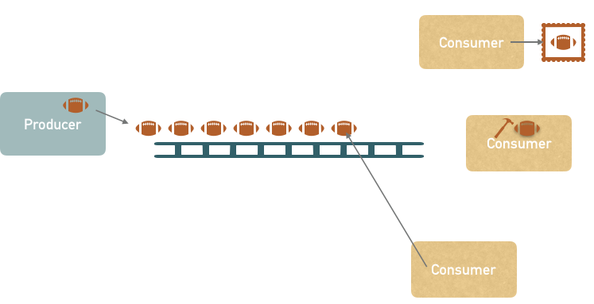

# 102_ProducerConsunmer

## Producer
- [ ] der Produzent produziert Footballs (simuliert durch Zufallszahlen)
- [ ] die Produktion eins Footballs dauert eine zufällige Zeit (z.B. zw. 500 und 1000ms)
- [ ] die produzierten Footballs werden gedanklich auf ein Fließband gelegt (Speicherung in Queue)
- [ ] das Fließband ist auf 10 Footballs begrenzt, ist das Fließband voll, muss der Produzent warten
- [ ] der Produzent informiert die Consumer, sobald etwas am Fließband liegt

## Consumer
- [ ] Consumer schlafen, bis sie vom Produzenten informiert werden
- [ ] sobald sie aufwachen, nehmen sie sich das erste Element vom Fließband und packen es ein
- [ ] die Verarbeitung dauert eine zufällige Zeit (z.B. zw. 500 und 1000ms)

## Aufgabe
- [ ] Implementiere das oben genannte Consumer/Producer Beispiel mittels Warten und Benachrichtigen
- [ ] Pushe die Lösung auf Github
