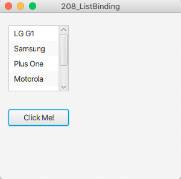

# 208_ListBinding

## Aufgabe:
- [ ] Erstelle zwei Listen mit Handymodellen (iOS/Android)
- [ ] eine Liste soll beim Start in einer ListView dargestellt werden
- [ ] klickt man auf den Button "ClickMe", so soll die 2. Liste angezeigt werden
- [ ] verwende Bindings in Kombination mit einer ObservableList
- [ ] die Listen sind statisch in ArrayLists zu speichern

