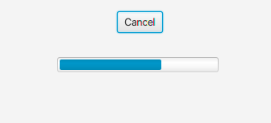

# 209_SimpleTask

## Aufgabe:
- [ ] Erstelle einen Task, welcher bis 100 zählt und jeweils 100ms zwischen den einzelnen Iterationen wartet
- [ ] der Task soll abgebrochen werden können
- [ ] erstelle weiters eine JavaFX GUI, welche aus einem Button (Start) besteht mit dem der Task gestartet und gecancelt werden kann
- [ ] verwende eine Progressbar, um den Fortschritt anzuzeigen
- [ ] über den Button kann der Task beendet werden

