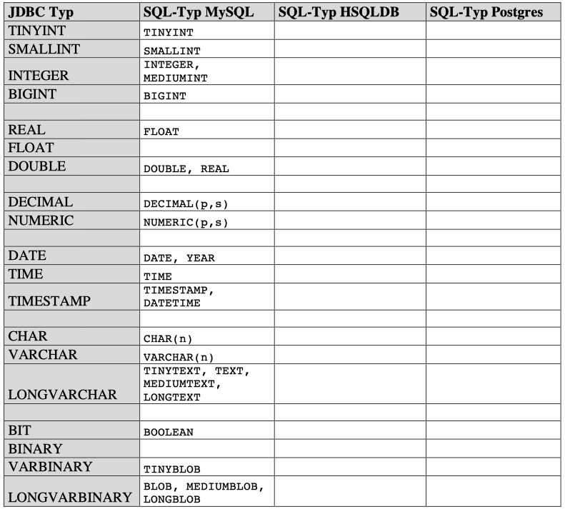

# 402_SQL_Types

Leider entsprechen nicht alle SQL Datentypen in allen DBMS den JDBC Typen.

## Aufgabe:
- Finde die korrespondierenden Datentypen für HSQLD bzw. Postgres/MySQL
- Vervollständige die Tabelle
- Gib deine Quelle(n) an!

