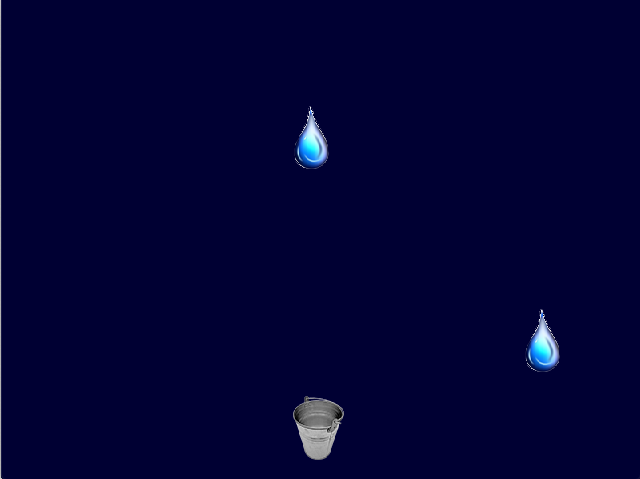

# 902_Raindrop

Entwickle das Raindrop Spiel, wo du mit einem Kübel zufällig herunterfallende Regentropfen auffangen musst.

## Steuerung
Die Steuerung erfolgt wahlweise über die Maus oder über die Pfeiltasten (links und rechts)

## Assets
alles Assets findest du unter core/assets/

## Sound und Musik
wird ein Tropfen aufgefangen, so soll 'drop.wav' abgespielt werden, als "Hintergrundmusik" dient die Aufnahme "rain.mp3"

## Screenshot
Das fertige Spiel:

