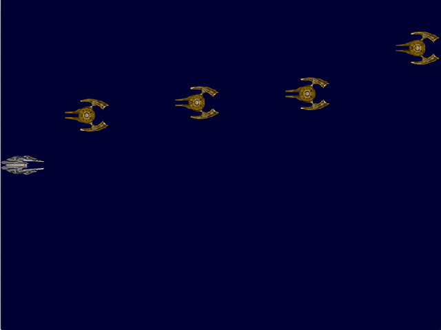

# 903_SpaceShooter

Entwickle analog zum Raindrop Spiel einen SpaceShooter in Sidescroller Manier.

Das Raumschiff fliegt in horizontaler Richtung von rechts kommen zufällig generierte gegnerische Raumschiffe entgegen.
Der Kontakt mit den anderen Schiffen endet tödlich, das Raumschiff kann auf die Gegner schießen. Ein Treffer eliminiert das gegnerische Schiff.

## Steuerung
Die Steuerung erfolgt über Pfeiltasten, mit Space wird geschossen.

## Assets
Alle Assets findest du unter core/assets/ es dürfen auch eigene Assets verwendet werden.

## Sound und Musik
Sounds bzw. Musik sind selbst im Netz zu suchen (frei verfügbare Assets suchen!)

## Screenshot
Das fertige Spiel:

